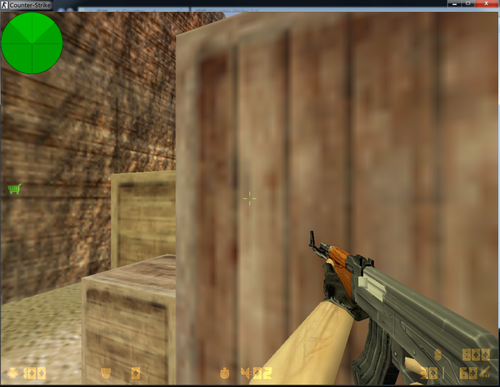
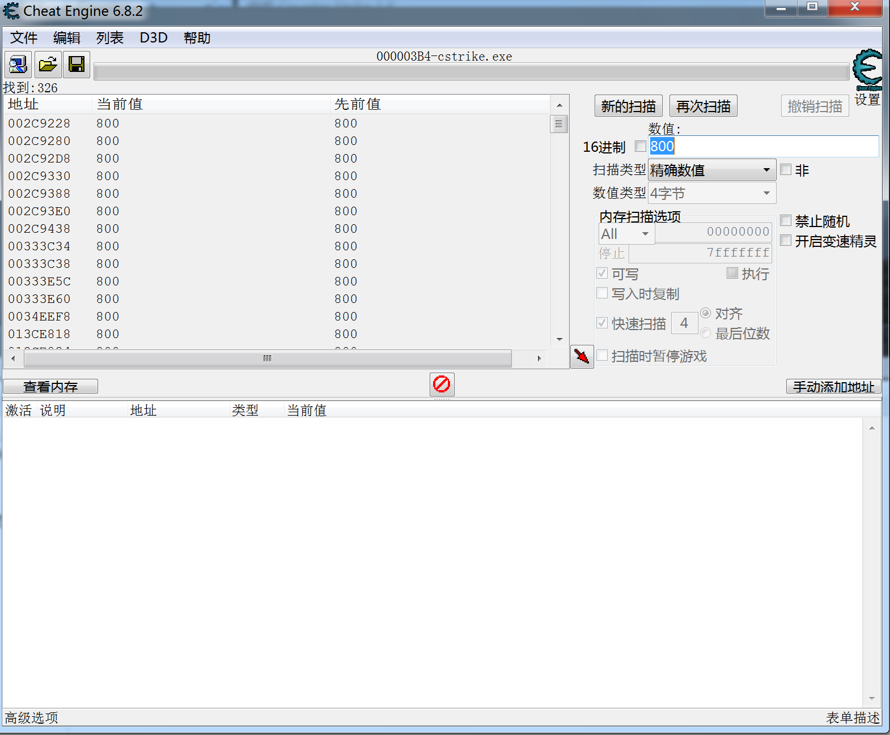
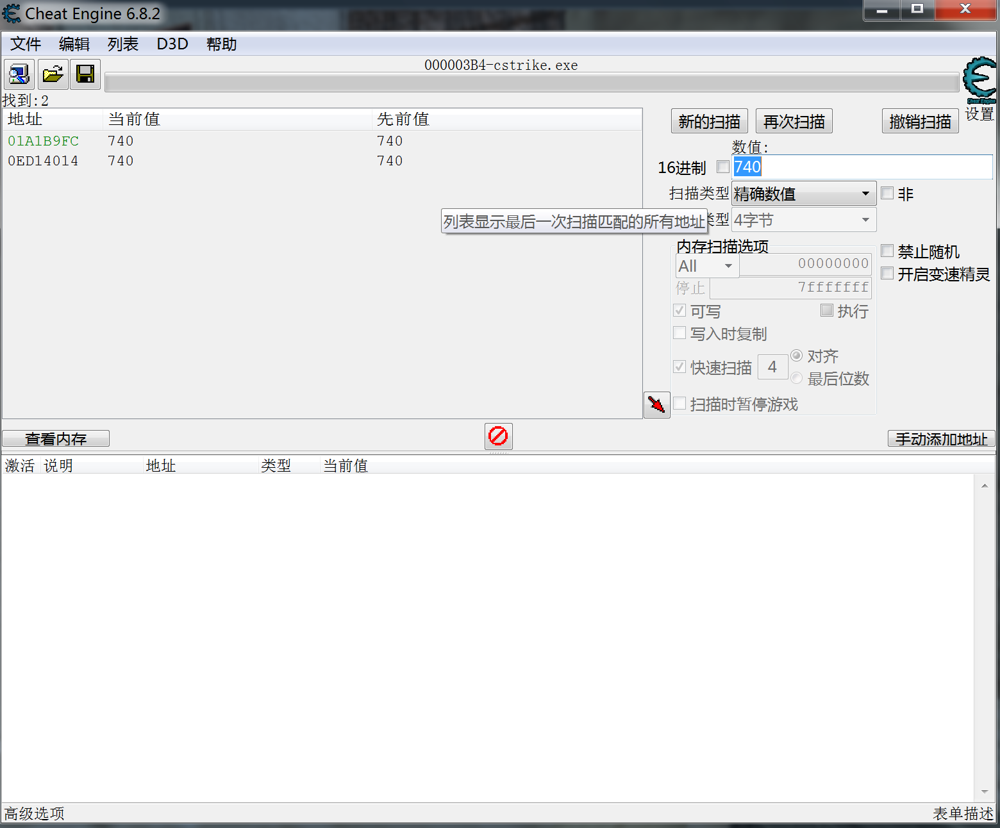
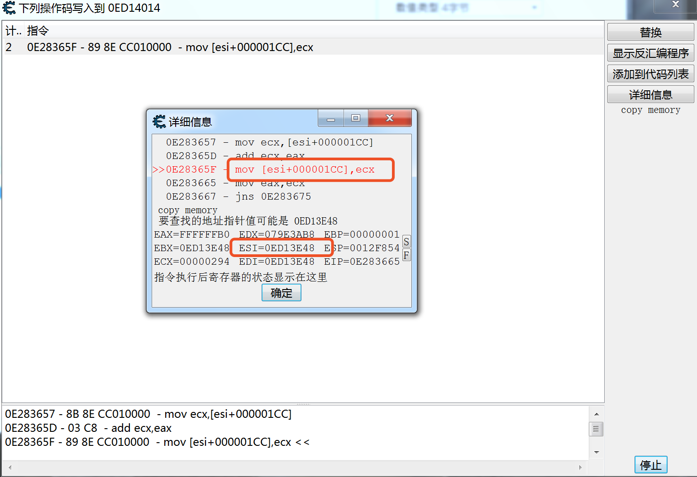
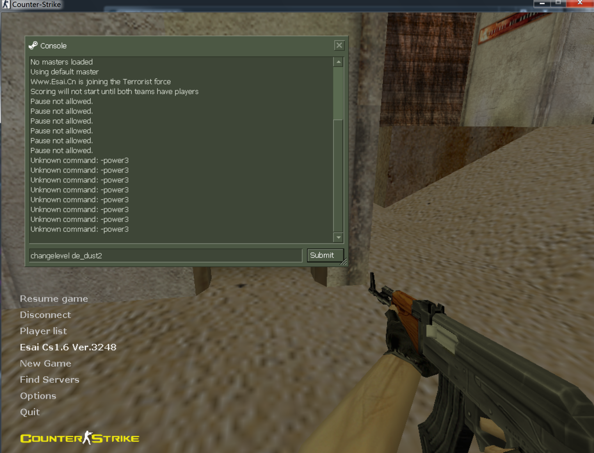
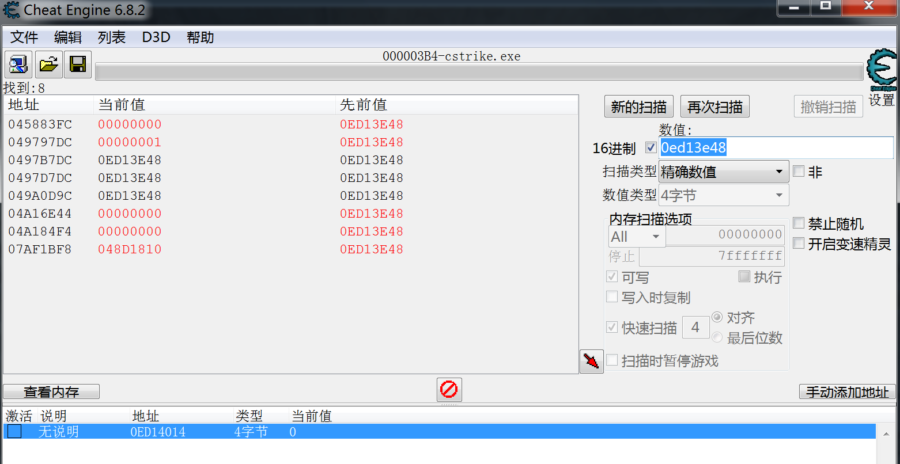
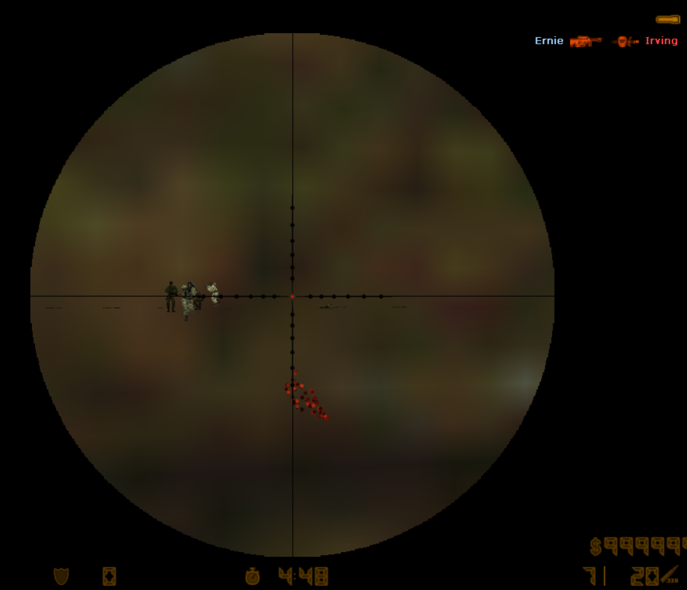

# 基于Opengl API Hook 的cs1.6 外挂制作


## 使用工具 

- cheat engine
- visual studio


## 使用技术

- 远程线程创建
- DLL注入
- 数据多级指针寻址
- 远程代码段、数据段数值修改
- API hook


## 具体说明


### 远程线程创建&DLL注入


同之前的小实验一样，为了在远程的线程中创建我们写好的dll，需要用到Kernel中的LoadLibraryA函数，整个过程的基本思想是，先根据进程名获取进程id，根据进程id获取进程句柄，分配空间并写入我们的dll地址，获取LoadLibraryA的地址，然后的远程执行LoadLibraryA，是的可以导入我们的dll


```c++
#include <windows.h>
#include <stdio.h>
#include <tlhelp32.h>

int main() {
	char szDllName[] = "C:\\Users\\truman\\source\\repos\\part1\\Debug\\Project1.dll";

	/* Step 1 */
	PROCESSENTRY32 ProcessEntry = {};
	ProcessEntry.dwSize = sizeof(PROCESSENTRY32);
	HANDLE hProcessSnap = CreateToolhelp32Snapshot(TH32CS_SNAPPROCESS, 0);
	bool bRet = Process32First(hProcessSnap, &ProcessEntry);
	DWORD dwProcessId = 0;
	while (bRet) {
		if (strcmp("cstrike.exe", ProcessEntry.szExeFile) == 0) {
			dwProcessId = ProcessEntry.th32ProcessID;
			break;
		}
		bRet = Process32Next(hProcessSnap, &ProcessEntry);
	}
	if (0 == dwProcessId) {
		return 1;
	}

	/* Step 2 */
	HANDLE hProcess = OpenProcess(PROCESS_ALL_ACCESS, FALSE, dwProcessId);
	if (0 == hProcess) {
		return 1;
	}

	/* Step 3 */
	size_t length = strlen(szDllName) + 1;
	char * pszDllFile = (char *)VirtualAllocEx(hProcess, NULL, length, MEM_COMMIT, PAGE_READWRITE);
	if (0 == pszDllFile) {
		return 1;
	}

	/* Step 4 */
	if (!WriteProcessMemory(hProcess, (PVOID)pszDllFile, (PVOID)szDllName, length, NULL)) {
		return 1;
	}

	/* Step 5 */
	PTHREAD_START_ROUTINE pfnThreadRtn = (PTHREAD_START_ROUTINE)GetProcAddress(GetModuleHandle("kernel32"), "LoadLibraryA");
	if (0 == pfnThreadRtn) {
		return 1;
	}

	/* Step 6 */
	HANDLE hThread = CreateRemoteThread(hProcess, NULL, 0, pfnThreadRtn, (PVOID)pszDllFile, 0, NULL);
	if (0 == hThread) {
		return 1;
	}

	/* Step 7 */
	WaitForSingleObject(hThread, INFINITE);

	VirtualFreeEx(hProcess, (PVOID)pszDllFile, 0, MEM_RELEASE);
	CloseHandle(hThread);
	CloseHandle(hProcess);

	return 0;
}
```


## 寻找我们需要的数值

这里以cs中的金钱为例，由于之前制作植物大战僵尸的外挂，所以这次上手到略微轻松了一些。果然这种数值查找是一个技术活。

打开游戏，开始一句游戏，初始值为800，同时打开我们的CE开始第一次查找








购买若干子弹，再次扫描，可以大幅缩小数据范围。

剩下的数据中，对于第一个数据，经过修改后会发现，并不是我们想要的”金钱“数值，故基本可以确定此时表示金钱的数值为内存中的`0ED14014`




然而，并没有结束，这是个动态地址，每次启动游戏，每次开始新的游戏，都是不同的，我们需要找到基址加偏移，基本思想也很简单。


首先查看谁使用了那个地址作为数值，或者谁修改了那个地址的数值,这里可以找到上一级的寻址



继续在内存中搜索esi对应的数值。

ce的核心就是不断修改数据，不断过滤 变/不变 的数据。在同一局游戏中，经过试验，上一级的地址是不变的，更换地图之后，就会发生改变，这时候就可以定位上上级的地址



此时筛选出变量



继续修改金钱，不断定位，找到最初的偏移量`[[cstrike.exe+0x11069BC + 0x1400000]+7c]+1cc]`


然后就是修改函数，我写成了两个部分，一个是初始化部分，一个是hook之后不断执行的部分，已达到锁定金钱的目的


```c++
void money_init()
{
	cs_hwnd = FindWindow(NULL, L"Counter-Strike");
	GetWindowThreadProcessId(cs_hwnd, &cs_dwPID);
	cs_hProcess = OpenProcess(PROCESS_ALL_ACCESS, FALSE, cs_dwPID);
	ptr = (0x11069BC + 0x1400000);
	
	x_ray = true;
}

void change_money() {
	ReadProcessMemory(cs_hProcess, (DWORD*)ptr, &ptr1, 4, NULL);
	ptr1 += 0x7c;
	ReadProcessMemory(cs_hProcess, (DWORD*)ptr1, &ptr2, 4, NULL);
	ptr2 += 0x1cc;
	value = 999999;
	WriteProcessMemory(cs_hProcess, (DWORD*)ptr2, &value, 4, NULL);
}
```


### OpenGL API Hook


透视功能的实现理论上也可以通过不断修改数值和不断搜索，得到，但这学期为了使用新学的只是，决定选择一个跟酷炫的方法实现。

cs1.6中，可以使用OpenGL的方式绘制各种模型，包括人物，如果我们能找到对应的函数并经过一番Hook，修改成我们给定的参数，就能实现游戏内任何人物都不会被墙挡住，即**透视功能**


```c++
void APIENTRY hook_glBegin(GLenum mode) {
	//if push F1_key
	if (GetAsyncKeyState(VK_F1) & 1) x_ray ^= 1;
	if (x_ray) {
		if (mode == GL_TRIANGLES || mode == GL_TRIANGLE_STRIP || mode == GL_TRIANGLE_FAN)
			glDepthRange(0, 0.5);
		else
			glDepthRange(0.5, 1);
	}
	change_money();
	if (pglBegin)
		(*pglBegin)(mode);
}
```

上述代码中，可以按键开启。经过一番查询，人物绘制相关用到了`glBegin`函数，而修改深度范围既可以实现不被遮挡的效果，执行完我们自己写的函数之后，在跳到源函数中即可，那么问题来了，如何Hook呢？我先画个图。


简单说一下原理

`old_entry`是原来的函数地址入口，我们修订头五个字节是的它直接跳转到我们的函数。

但是修改，就覆盖了原来的部分数据，这些代码段的数据最后肯定还是要执行的，不然肯定会保存，所以我们需要备份到一块新的地址处，备份多长呢？这取决于这个函数中的传参个数和传参类型大小，（详见大二逆向工程）我们所用到的函数，传参初始化用到了6个字节，蓝色部分即使我们的备份。

`new_entry`最后肯定还是要返回到原来的代码地址上的，来保证程序正常工作，结尾在加一些`jmp`跳转。定义一个函数指针，参数个数与原来相似，地址为new_entry，那么就可以把这一段当成代码来使用，只需要在我们的hook函数中调用函数即可。


```c++
void * get_new_func(BYTE *old_en, const BYTE *my_func, const int block_len)
{
	BYTE *new_en = (BYTE*)malloc(block_len + 5);
	DWORD temp;
	//able to write my own program 
	VirtualProtect(old_en , block_len, PAGE_READWRITE, &temp);
	memcpy(new_en, old_en, block_len);
	new_en += block_len;
	new_en[0] = old_en[0] =  0xE9;
	*(DWORD*)(new_en+ 1) = (DWORD)(old_en + block_len- new_en) - 5; 
	*(DWORD*)(old_en+ 1) = (DWORD)(my_func- old_en) - 5; 
	VirtualProtect(old_en, block_len, temp, &temp); 
	return (new_en - block_len); 
}
void HookOpenGL() {
	HMODULE hOpenGL = GetModuleHandle(L"opengl32.dll");
	pglBegin = (glBegin_t)get_new_func((LPBYTE)GetProcAddress(hOpenGL, "glBegin"), (LPBYTE)&hook_glBegin, 6);
}
```


实现的效果如下



