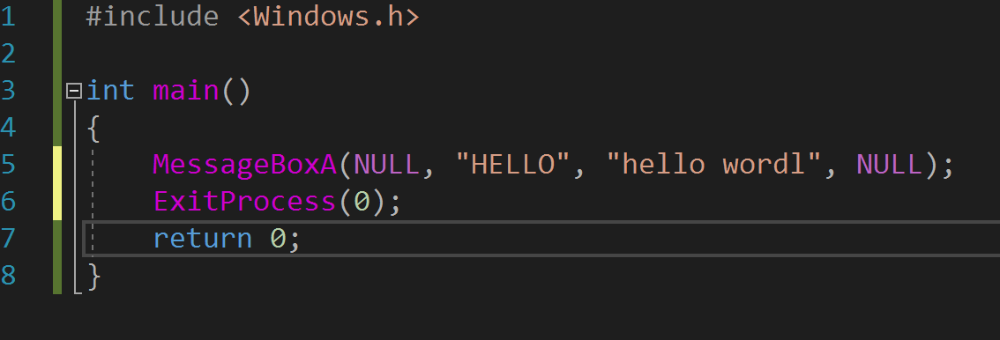
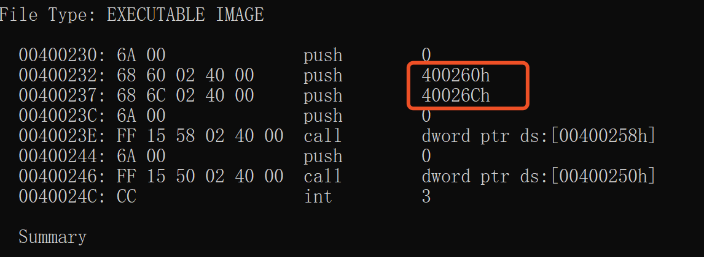
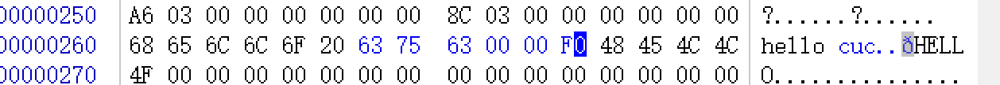
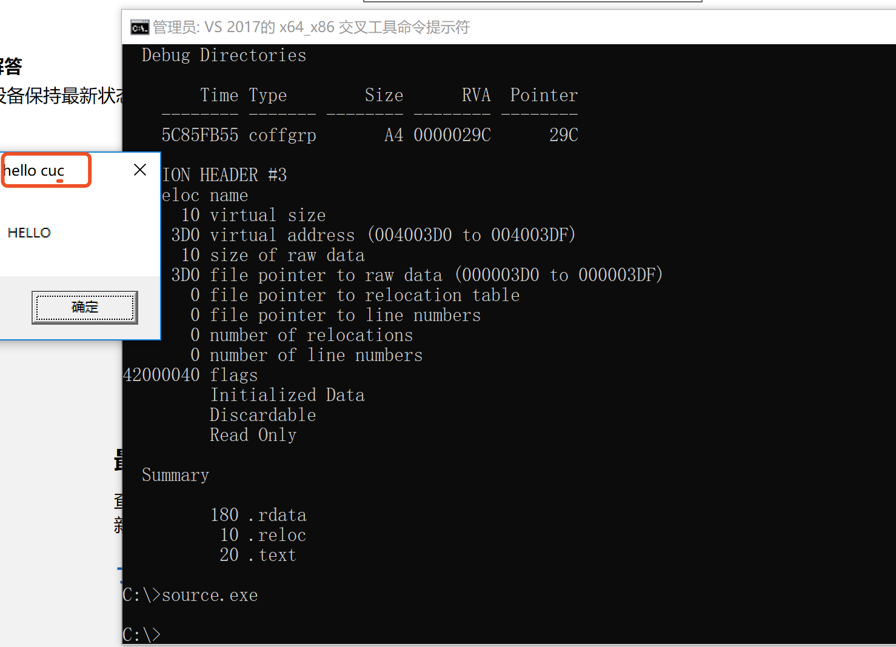

# 第一题 实验报告

- 编写程序，弹出窗口 
- 输入指令`cl /c /O2 source.cpp` , `link /nologo /ENTRY:main /NODEFAULTLIB /SUBSYSTEM:WINDOWS /ALIGN:16 source.obj user32.lib kernel32.lib`，得到尽可能小的pe文件。 
- 反汇编查看字符串地址 
- 通过文件头查看基地址 
- 定位到字符串的位置，打开winhex进行修改 
- 保存，重新运行，结果如下,成功修改字符串 

